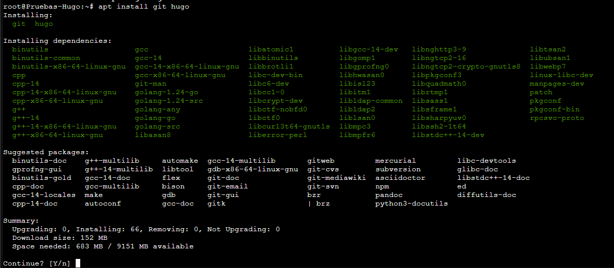
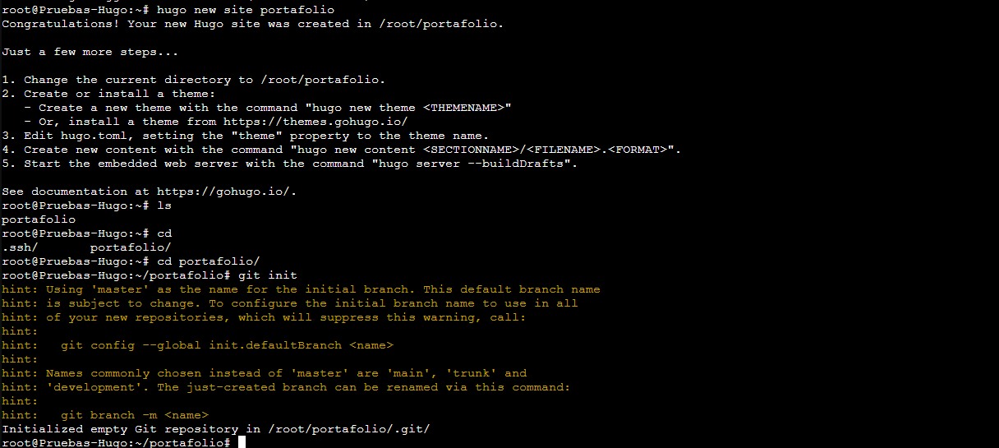

+++
title = 'Pruebas'  
date = 2026-08-13T09:24:37Z  
draft = false
showAuthor= true
+++

Aquí vamos a ver como crear nuestra web portafolio con HUGO y Blowfish, para posteriormente subirlo a github vía github pages.

Requisitos previos:

Tener un repositorio de Github

Tener docker instalado o hacerlo en una máquina Linux

Este tutorial es para Linux, yo todo este tutorial lo voy a hacer en un contenedor LXC de mi Proxmox.

Lo primero será instalar HUGO, actualizamos repositorios y luego lo instalamos

```bash
sudo apt update && sudo apt install git hugo
```



Con esto tendremos instalado tanto Git para poder subir la página a github vía Github pages.

Ahora que tenemos esto instalado, podemos crear el proyecto base. 

```bash
hugo new site portafolio
cd portafolio
git init
```
